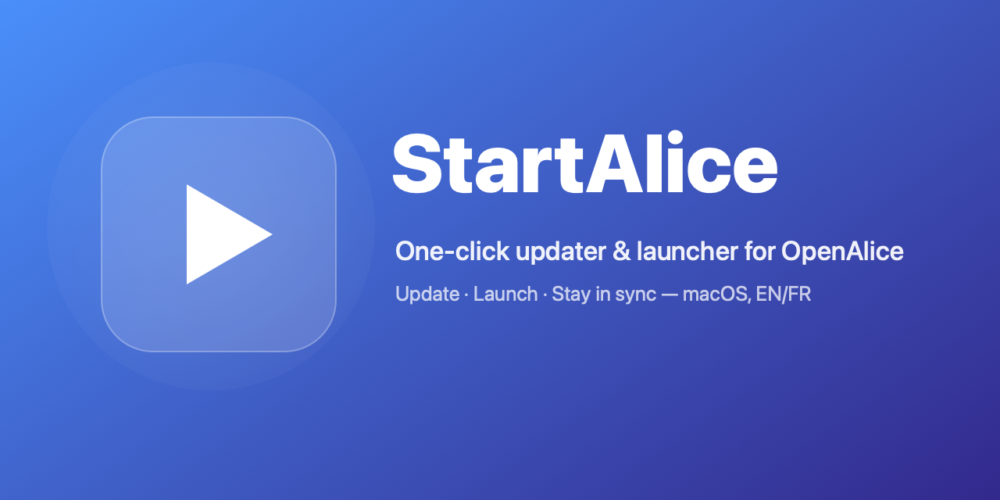

<div align="center">



# StartAlice

**Mise à jour & lancement en un clic d'[OpenAlice](https://github.com/TraderAlice/OpenAlice) — l'agent de trading IA open-source.**

[](https://github.com/vincentlauriat/StartAlice/releases)
[](https://github.com/vincentlauriat/StartAlice/releases)
[](#langues)
[](LICENSE)

[🇬🇧 English](README.md) · 🇫🇷 Français

</div>

---

## Pourquoi StartAlice ?

OpenAlice évolue vite — de nouvelles betas sortent presque chaque jour. Garder un
checkout local à jour signifie normalement penser à faire `git fetch`, merger
`master`, relancer `pnpm install`, *puis* redémarrer l'app. StartAlice condense
tout ce rituel en **une fenêtre, un bouton**.

Tu l'ouvres et tu vois immédiatement si tu es sur la dernière version. Un clic te
met à jour (config sauvegardée d'abord), un autre lance OpenAlice — en mode
développement ou en app desktop packagée. Pas encore installé ? StartAlice le
clone et le configure pour toi.

<div align="center">

| Sans StartAlice | Avec StartAlice |
|---|---|
| `git fetch && git merge origin/master` | Clic sur **Mettre à jour** |
| `pnpm install` | *(fait automatiquement)* |
| `pnpm dev` *ou* build de l'app | Clic sur **Lancer** |
| « Suis-je seulement à jour ? » | Une pastille verte le dit |

</div>

## Qu'est-ce qu'OpenAlice ?

[**OpenAlice**](https://github.com/TraderAlice/OpenAlice) est un **agent de
trading IA** open-source. Plutôt qu'un bot rigide, il donne à une IA un espace de
travail géré où elle peut faire de la recherche, itérer sur des stratégies
quantitatives et agir — avec **données de marché, analyse technique et actualités**
injectées en contexte, et les connexions courtier isolées dans un processus
séparé, façon hardware-wallet.

- 🧠 **CLIs d'agents natifs** (`claude`, `codex`, `opencode`, …) tournent dans des
  workspaces persistants et sandboxables.
- 📈 **Contexte de trading à la demande** — données de marché, indicateurs,
  actualités et un SDK courtier exposés via MCP.
- 🔐 **Séparation des responsabilités** — identifiants et état de trading vivent
  dans leur propre processus ; tout l'état est en fichiers, sans base de données.

StartAlice est la façon la plus simple de le faire tourner sur ton Mac et de le
garder à jour.

## Fonctionnalités

- ✅ **Statut en direct** — version locale vs dernière release GitHub, branche
  courante et nombre de commits de retard sur `master`, d'un coup d'œil.
- ⬇️ **Mise à jour en un clic** — sauvegarde ta config, merge `master`,
  réinstalle les dépendances.
- ▶️ **Lancement au choix** — mode développement (`pnpm dev`) ou app Electron
  packagée.
- 📦 **Installation guidée** — pas de checkout ? StartAlice clone OpenAlice et
  lance la première installation pour toi.
- 💾 **Config préservée par design** — tes réglages vivent dans `~/.openalice/`
  (courtiers, clés API, providers), *hors* du repo : les mises à jour n'y
  touchent jamais. StartAlice en fait aussi un instantané avant chaque update.
- 🌍 **Bilingue** — anglais & français, selon la langue de ton Mac par défaut,
  changeable à tout moment.

## Installation

1. Télécharge le dernier **`StartAlice-x.y.z.dmg`** depuis la
   [page Releases](https://github.com/vincentlauriat/StartAlice/releases).
2. Ouvre le DMG et glisse **StartAlice** dans **Applications**.
3. Lance-le. L'app est **signée Developer ID et notarisée par Apple** : elle
   s'ouvre sans avertissement de sécurité.

> **Première action :** au premier clic sur un bouton d'action, macOS demande
> l'autorisation de piloter **Terminal** (Automation). Accepte-la — les commandes
> longues s'exécutent dans une fenêtre Terminal visible pour que tu voies les logs.

### Prérequis

- macOS 13 (Ventura) ou plus récent.
- [Node.js](https://nodejs.org) + [pnpm](https://pnpm.io) et `git` dans le PATH
  (requis par OpenAlice lui-même). `git` est fourni par les Xcode Command Line
  Tools.

## Utilisation

| Bouton | Ce qu'il fait |
|---|---|
| **Mettre à jour** | Sauvegarde config → `git merge origin/master` → `pnpm install` |
| **Lancer (dev)** | `pnpm dev` — Guardian démarre UTA + Alice + Vite (http://localhost:5173) |
| **Lancer (app)** | `pnpm build` puis l'app Electron packagée |
| **Sauvegarder ma config** | Copie horodatée de `~/.openalice/` |
| **Installer OpenAlice** | *(affiché si aucun checkout)* clone le repo + première install |

Le chemin du checkout est éditable en bas de la fenêtre (défaut :
`~/DevApps/FinancesTools/OpenAlice`) et mémorisé entre les lancements.

<a name="langues"></a>
## Langues

StartAlice est livré en **anglais et français**. Il suit la langue de ton Mac au
premier lancement (français si ton système est en français, anglais sinon) et tu
peux forcer le choix à tout moment via **Paramètres → Langue** (Système /
Français / English). Le changement est instantané — pas de redémarrage.

## Build depuis les sources

```bash
brew install xcodegen
git clone https://github.com/vincentlauriat/StartAlice.git
cd StartAlice
xcodegen generate
open StartAlice.xcodeproj      # puis Cmd+R
```

Régénérer l'icône ou le DMG de release :

```bash
swift Scripts/make-icon.swift preview          # aperçu de l'icône
./Scripts/release.sh 0.1.0                      # DMG signé + notarisé
```

## Comment ça marche

Une petite app SwiftUI. L'UI est un panneau de contrôle léger ; tout le gros
œuvre (vérifs de statut, git, pnpm, install, lancement) vit dans un unique
`actions.sh` embarqué dans le bundle et exécuté dans Terminal.app pour des logs
visibles.

```
Sources/
  StartAliceApp.swift    point d'entrée
  ContentView.swift      panneau de contrôle + paramètres
  AliceController.swift   orchestration + statut
  Localization.swift     chaînes EN/FR + switch de langue
  Runner.swift           shell (capture) & Terminal (osascript)
Resources/
  actions.sh             status / update / dev / packaged / backup / install
Scripts/
  make-icon.swift · make-banner.swift · make-dmg-background.swift · release.sh
```

Le pipeline de release (`Scripts/release.sh`) reprend le flux éprouvé de son app
sœur *MarkdownViewer* : copie `ditto` en staging, codesign Developer ID +
Hardened Runtime, DMG mis en page dans le Finder, notarisation Apple et staple.

## Contribuer

Issues et idées bienvenues. StartAlice est volontairement petit — un launcher,
pas un framework — donc les meilleures contributions sont ciblées : un correctif,
une nouvelle langue, une amélioration d'UX.

## Licence

[MIT](LICENSE) © Vincent Lauriat
